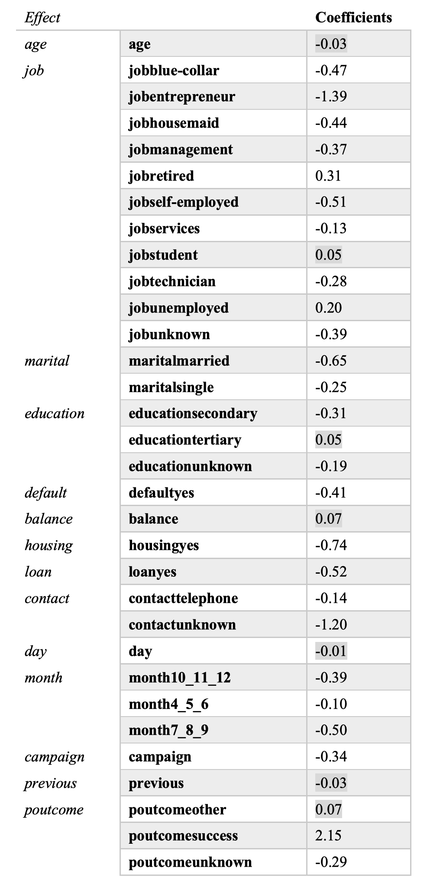

```{r setup, include=FALSE}
knitr::opts_chunk$set(echo = FALSE)

# load packages
pkgs <- list('tidyverse', 'table1', 'e1071', 'caret', 'ROCR', 'devtools', 'OptimalCutpoints', 'car', 'WeightSVM')
lapply(pkgs, require, character.only = T)
load_all('./final')

# set ggplot theme
theme_set(theme_bw())

# read data
dat_full <- read_delim("bank-full.csv",
           delim=';')
```

## Introduction

The topic of our project is to improve the performance in telemarketing using predictive models. Telemarketing is a method of marketing directly to customers via phone or the Internet in order to sell goods or services. Telemarketing Industry has a market size of $23.4 bn in 2022 and is still expecting a 2% growth in market size.[ref](https://www.ibisworld.com/industry-statistics/market-size/telemarketing-call-centers-united-states/) A central challenge in telemarketing is in targeting individuals to sell goods or services. It would be costly to indiscriminately canvas everyone, but it would also be undesirable to target a random subset of the population as many potential sales could be lost. Thus, there is great interest in tools to identify the groups of individuals for whom telemarketing would likely result in sales and the groups of whom telemarketing is unlikely to be successful. Then, the firm could save resources by ignoring those in the latter group while not losing out on potential sales @marshall1988successfully. 

The goal of this project is to predict the success of telemarketing using potential customers’ key metrics. We will use predictive statistical models to predict whether a client would agree to subscribe a term deposit of future telemarketing campaigns based on historical data. The expected results for this project are: 1. Construct a ridge logistic regression model from scratch and implement in an R package that can be applied in future similar problems; 2. Fit a support vector machine model using R package and compare the results with ridge logistic regression model


In this project, we analyse a telemarketing dataset from a Portuguese retail bank [dataset](https://archive.ics.uci.edu/ml/datasets/bank+marketing) @moro2014data, which contains information on clients who were contacted by phone call to sell term deposit subscriptions and the outcome of the contact, which is a binary indicator for if the client subscribed a term deposit. There were 45211 observations and 16 features, which are summarized in Table \ref{}. There are some missing values in the dataset (column `pdays`). We also treat the response `unknown` as one category instead of the missing values. The binary outcome variable is highly imbalanced, with 39922 failures and 5289 successes. 

The goal of this project is to build a classifier using the covariates listed in Table \ref{} to predict whether or not that client subscribed a term deposit. We choose Accuracy, Kappa, Sensitivity, Specificity and F1 Score as the criterion we will use to evaluate model performance. We used logistic regression with a ridge penalty and support vector machines (SVM) as the candidate models. We also developed an R package that can be used to replicate our analysis. All analysis materials are in our Github page [Github link](https://github.com/ReneeDu320/BIOS735-Project). 

```{r DataDescription, results = "asis", echo = FALSE, message = FALSE}
library(knitr)

tex2markdown <- function(texstring) {
  writeLines(text = texstring,
             con = myfile <- tempfile(fileext = ".tex"))
  texfile <- pandoc(input = myfile, format = "html")
  cat(readLines(texfile), sep = "\n")
  unlink(c(myfile, texfile))
}

textable <- "
\\begin{table}[ht]
\\centering
\\caption{Description of variables in telemarketing data set}
\\begin{tabular}{| l | l |}
\\hline
Feature Name & Description   \\\\
\\hline
age          & numeric  \\\\
job          & type of job (categorical) \\\\
marital      & marital status (categorical: married, divorced, single) \\\\
education    & (categorical: unknown,secondary, primary, tertiary) \\\\
default      & has credit in default? (binary: yes, no)\\\\
balance      & average yearly balance, in euros (numeric)\\\\
housing      & has housing loan? (binary: yes, no)\\\\
loan         & has personal loan? (binary: yes, no)\\\\
contact      & contact communication type (categorical: unknown, telephone, cellular)\\\\
day          & last contact day of the month (numeric)\\\\
month        & last contact month of year (categorical: jan, feb, mar, ..., nov, dec)\\\\
duration     & last contact duration, in seconds (numeric)\\\\
campaign     & number of contacts performed during this campaign and for this client (numeric)\\\\
pdays        & number of days that passed by after last contacted from a previous campaign (numeric) \\\\
previous     & number of contacts performed before this campaign and for this client (numeric) \\\\
poutcome     & outcome of previous campaign (categorical: unknown, other, failure, success) \\\\
outcome      & has the client subscribed a term deposit? (binary: yes, no)                                                                                                               
\\end{tabular}
\\label{table:1}
\\end{table}
"

tex2markdown(textable)
```

## Data pre-processing

There are four datasets available. We choose the dataset with 16 features and all observations (called `bank-full.csv` on the source website). To ease computational burden, we randomly select 20 percent of the data for our analysis dataset(`dat.working`), which includes 9042 observations.

```{r DataPreprocessing, warning=FALSE}
# combine the labels
q1 <- c('mar','feb','jan')
q2 <- c('apr','may','jun')
q3 <- c('jul','aug','sep')
q4 <- c('nov','oct','dec')

#collape month into quarters
dat_full$month<-recode(dat_full$month,"q1='1_2_3'; q2='4_5_6';
                      q3 = '7_8_9'; q4 = '10_11_12'")

# drop pdays and duration
dat = dat_full %>% select(-pdays, -duration)

# analysis dataset
set.seed(100)
dat.working <- dat %>% 
  mutate(age = scale2sd(age),
         campaign = scale2sd(campaign),
         balance = scale2sd(balance),
         previous = scale2sd(previous)) %>% # put continuous vars on same scale as indicators
  mutate_if(is.character, as.factor) %>% # convert character to factor
  slice_sample(prop = 0.2) # select subset
```

A brief overview of some important features from the analysis dataset(`dat.working`) is as follows:

```{r table1}
table1(~age + job + marital + education + balance|y, data = dat.working)
```

We dropped the variable `pdays` from the analysis dataset because more than 80% of the data were missing for the variable. We also droped the variable `duration` from the analysis dataset because this variable is collected after the company's phone call to customers, so that the outcome is already known. Thus, it should not appear in the predictive model. We also collapsed months into quarters. Continuous variables were centered and scaled by two standard deviations to be put on approximately the same scale as categorical covariates [cite Gelman paper]. 

We hold out 20 percent of the data as a test set for final model performance evaluation. The remaining 80 percent of the data is used as training data to select hyperparameters in the logistic regression and SVM models. 

```{r SelectTrain/test}
# select training and testing data
set.seed(100)
y <- dat.working$y
index <- createDataPartition(
  y,
  times = 1,
  p = 0.8,
  list = F,
  groups = min(5, length(y))
)
dat_train <- dat.working[index,]
dat_test <- dat.working[-index,]

```

The following plots show some insights from the original dataset. People aged from 25-50 are more considered as potential customers since the density for this age group is especially high in the plot.

```{r AgePlot1}
ggplot(dat_full, aes(x = age, fill = y)) + geom_density(alpha = 0.5,position = 'stack') + theme_classic()+ labs(fill = "subscribed") + ggtitle('age density plot based on labels')
```

The following plot gives a distribution of mean_balance over age group. The average balance amount increased along with the increase in age. This is common that aged people typically have a higher balance compared to the young people.

```{r AgePlot2, include=FALSE}
data_new = dat_full%>%
  select(age, balance)%>%
  mutate(age_group =  case_when(age < 20 ~ "<20",
                                
                           30 > age & age >= 20 ~ "20-30",
                           40> age & age >= 30 ~ "30-40",
                         50 > age & age >= 40 ~ "40-50",
                           60 > age & age >= 50 ~ "50-60",
                         70 > age & age >= 60 ~ "60-70",
                         80 > age & age >=70 ~ "70-80",
                         age >= 80 ~ "80-100"
                         
                         ))%>%
  group_by(age_group)%>%
  summarise(mean_balance = sum(balance)/n() )
```

```{r AgePlot3}
ggplot(data_new, aes( y=mean_balance, x=age_group)) + 
    geom_bar(position="dodge", stat="identity",fill = 'plum3') +
  ggtitle('mean_balance by age group') + theme_minimal()

```

Grouping the job categories into `high_income`(including 'admin.','entrepreneur','management','services','technician'), `low_income`(including 'blue-collar','housemaid','retired','self-employed'), `no_income`(including 'unemployed','student') and `unkown`('unkown'), the number of total compaigns sent to each group has been plotted as below:
Companies are spending more efforts in engaging high-income group and low-income group, while these two groups have similar subscription rates.

```{r CampaignPlot}
unknown <- c('unknown')
no_income <- c('unemployed','student')
low_income <- c('blue-collar','housemaid','retired','self-employed')
high_income <- c('admin.','entrepreneur','management','services','technician')
dat_plot <- dat_full
dat_plot$job<-recode(dat_plot$job,"unknown='unknown'; no_income='no_income';
                      low_income = 'low_income'; high_income = 'high_income'")

ggplot(dat_plot, aes(fill=y, y= campaign, x=job)) + 
    geom_bar(position="stack", stat="identity") + theme_classic()+ labs(fill = "subscribed") + ggtitle('Number of total campaigns sent for each job_type')+scale_fill_manual(values = c("burlywood1","darkolivegreen3"))
```


## Methods

We choose logistic regression as our likelihood-based model since it allows for classification. We consider a ridge penalty here since penalization often improves prediction, which is the primary goal. A ridge penalty is chosen as opposed to a lasso penalty since the number of features is relatively few compared to the number of observations so feature selection may be unnecessary. 

Support vector machines were chosen for their flexibility and good out-of-box performance for classification. By fitting SVM using both linear and RBF kernels, we allow for flexibility in the relationship between the outcome and features. 


### Logistic regression with ridge penalty

We will use the logistic regression modelling framework. We have $i=1, 2, ... , n$ subjects. We observe the outcome $Y_{i}$ for subject $i$, and we observe the subject's covariates $x_{i}$.

Assume $y_{i}|x_{i}\sim Binomial(1, p_{i})$ for $i=1, ..., n$;
$logit(p_{i})=log(\frac{p_{i}}{1-p_{i}})=x_{i}^T\beta=\eta_{i}$ for $i=1, ..., n$. Thus, the log-likelihood function of $\beta$ for the logistic regression model is given by
\begin{equation}
	l_{n}(\beta)=\sum_{i=1}^{n}\left\{y_{i}x_{i}^T\beta-log(1+exp(x_{i}^T\beta)) \right\}
\end{equation}
We will use Newton-Raphson algorithm to obtain the ML estimate $\hat{\beta}$ in this GLM model by
\begin{equation}
\begin{aligned}
	\beta^{(t+1)}&=\beta^{(t)}-l''(\beta^{(t+1)})^{-1}l'(\beta^{(t)})\\
	&=\beta^{(t)}+(X^TW^{(t)}X)^{-1}X^T(Y-p^{(t)})\\
	&=\beta^{(t)}+h^{(t)}
\end{aligned}
\end{equation}
where $p^{(t)}$ depends on $\beta^{(t)}$ and $W$ is a diagonal matrix with the $i$th diagonal element having value equal to $p_{i}(1-p_{i})$. $W^{(t)}$ is a function of $p^{(t)}$.

If we performed L2 regularization approach using ridge logistic regression @zou2005regularization. The objective function is the penalized log-likelihood, and is
\begin{equation}
	-\left[\frac{1}{N}\sum_{i=1}^{n}\left\{y_{i}x_{i}^T\beta-log(1+exp(x_{i}^T\beta)) \right\}\right]+\lambda(||\beta||_{2}),
\end{equation}
where $\lambda$ is a tuning parameter for the L2 the penalty. 
Similarly to Newton-Rapson algorithm, the optimization function to obtain the ridge estimated $\hat{\beta}_{ridge}$, the coefficients of ridge logistic regression is given by

$$
\beta_{t+1} = \beta_t + (X^TWX + \lambda I_p)^{-1}X^T(y-p),
$$
where the $I_p$ is a $p$ by $p$ identity matrix.

We used Iteratively Reweighted Least Squares (IRLS) @holland1977robust to perform optimization, and select the tuning parameter $\lambda$ using grid search for the $\lambda$ that yields the minimum mean square error (MSE) from cross-validation.

Both logistic regression and ridge logistic regression algorithm using IRLS approach can be summarized as follows:
{width=75%}

To decide the optimal cutoff probability for ridge logistic regression, we used the cutoff that maximizes F1 score. F1 score is the harmonic mean of the precision and recall: F1=2(P*R)/(P+R), where P is the precision: TP/(TP + FP), and R is the recall of the classification model: TP/(TP+FN), so that the F1 captures the prediction performance for both positive and negative classes.

### SVM

Support vector machines (SVM) @cortes1995support are a popular machine learning method for binary classification. SVM classifies observations by separating the feature space into two classes with the goal of maximizing the number of correct classifications while allowing for some mis-classifications for identifiability and to prevent over-fitting. The form of the decision boundary is controlled by choice of the kernel function. We will fit SVM models using linear and radial kernels. 

Formally, SVM solves the following Lagrangian dual

\begin{equation}
	\begin{split}
		\max_{\substack{\alpha}}  \sum_{i=1}^{n} \alpha_i - \frac{1}{2} \sum_{i, j = 1}^{n} y_i y_j \alpha_i \alpha_j K(x_i, x_j) \\
		\text{s.t. } 0 \leq \alpha_i \leq C, i=1,\dots, n \text{ and } \sum_{i=1}^{n} \alpha_i y_i = 0
	\end{split}
\end{equation}

where $y \in \{-1, 1\}$ are the classification labels, $\alpha$ are the Lagrangian multipliers, $C$ is a tuning parameter chosen by cross-validation, and $K(x, x')$ represents the kernel function. The linear kernel corresponds to the dot product between $x$ and $x'$, and the radial kernel corresponds to $K(x, x') = \exp\left(  \gamma ||x-x'||^2 \right)$ where $\gamma$ is a tuning parameter that will be chosen by cross-validation. 

Since the original SVM is not good at handling class imbalance in the sense that it favors majority class, we performed weighted SVM instead. For the class Y=1, the weight equals $1/mean(Y)$ where Y is the 0/1 outcome for training dataset, and for the class Y=0, the weight equals $1-1/mean(Y)$. Thus, we gave less weight on majority class and more weight on minority class.

We will fit SVM using the R package @kuhn2008building. 


### Model evaluation

We used 5-fold cross validation to select tuning parameters for both logistic regression and SVM. For logistic regression with ridge penalty, there is a hyperparameter, $\lambda$ in our notation above, which controls the amount of penalization. We compare _ different values of $\lambda$, [list the values we test] and chose the $\lambda$ which minimized the mean-squared error. 

For SVM, we used both a linear kernel and a radial basis function (RBF) kernel. SVM with a linear kernel contains a penalization hyperparameter $C$, and SVM with an RBF kernel contains a penalization hyperparameter $C$ as well as a tuning parameters $\gamma$ which accounts for the smoothness of the decision boundary and controls the variance of the model. For the linear kernel we test $C$=(0.001, 0.01, 0.1, 1, 5) and for the RBF kernel we test all combinations of $C$=(0.001, 0.01, 0.1, 1) and $\gamma$=(0.03125, 0.12500, 0.50000, 2.00000). The error function to minimize was the mis-classification rate. 

```{r FitRidge}
# fitting ridge logistic regression
# get data into format for logistic regression
x <- model.matrix(y~., dat_train)[,-1]
y2 <- ifelse(dat_train$y == "yes", 1, 0)
# # fit ridge logistc reg using glmnet
# library(glmnet)
# set.seed(100)
# cv.ridge <- cv.glmnet(x, y2, alpha = 0, family = "binomial")
# model <- glmnet(x, y2, family = "binomial", alpha = 0, lambda = cv.ridge$lambda.min)
# 
# # get predictions for test set
# x.test <- model.matrix(y~., dat_test)[,-1]
# probabilities.glmnet <- model %>% predict(newx = x.test, type='response')
# our ridge LR code
set.seed(100)
t0 = Sys.time()
# penalty parameters to test (on log-scale)
# NOTE: should change function argument to make clear it is on log-scale e.g. name it loglambda
lambdas = seq(-5,1,length.out=10)
# fit models using cv (read from file to save computation time)
# cv.ridgeLR <- cv.glm.logit.ridge(x, y2, lambdas, fold=5)
cv.ridgeLR = readRDS('cv_ridge.rds')
# saveRDS(cv.ridgeLR, 'cv_ridge.rds')  # save cv object (o/w takes 13 mins to run)
# print(Sys.time() - t0)
# best ridge logistic reg model
model.ridge <- glm.logit.ridge(x, y2, lambda = cv.ridgeLR$lambda.min)
# get probability predictions on test set
x.test <- model.matrix(y~., dat_test)[,-1]
probs.ridge.test <- predict.logistic(model.ridge, x.test)$prob
# ROC curve using ROCR package
pr.ridge.test <- prediction(probs.ridge.test, dat_test$y)
prf.ridge.test <- performance(pr.ridge.test, measure="tpr", x.measure="fpr")
# auc
ridge.auc = performance(pr.ridge.test, measure = 'auc')@y.values[[1]]
```


```{r RidgePerformance}
# Model performance - select logistic cutoff using training data
pr.ridge.train <- prediction(predict.logistic(model.ridge, x)$prob, dat_train$y)
# get sensitivity
sens <- data.frame(x=unlist(performance(pr.ridge.train, "sens")@x.values), 
                   y=unlist(performance(pr.ridge.train, "sens")@y.values))
# get specificity
spec <- data.frame(x=unlist(performance(pr.ridge.train, "spec")@x.values), 
                   y=unlist(performance(pr.ridge.train, "spec")@y.values))

# Select logistic cutoff using training data
# get precision
prec <- data.frame(x=unlist(performance(pr.ridge.train, "prec")@x.values), 
                   y=unlist(performance(pr.ridge.train, "prec")@y.values))
prec <- prec[-1,]
# get recall
rec <- data.frame(x=unlist(performance(pr.ridge.train, "rec")@x.values), 
                   y=unlist(performance(pr.ridge.train, "rec")@y.values))
rec <- rec[-1,]

cutoff <- prec$x[which(1/(rec$y)+1/(prec$y)==min(1/(rec$y)+1/(prec$y)))]
```

```{r WeightedSVM}
# weights for svm
w = rep(mean(y2), nrow(dat_train))
w = ifelse(y2==1, 1-w, w)
# Linear SVM: tune cost parameter 
set.seed(100)
# best.linear = best.tune_wsvm(train.x=x, train.y=dat_train$y, weight=w, ranges=list(cost=c(0.001, 0.01, 0.1, 1, 5)),
#                              tunecontrol=tune.control(sampling='cross', cross=5),
#                              kernel='linear', scale=FALSE)
# save/load for computational ease
# saveRDS(best.linear, 'cv_sim_lin.rds')
best.linear = readRDS('cv_sim_lin.rds')
# Radial SVM: tune cost parameter
set.seed(100)
# best.radial = best.tune_wsvm(train.x=x, train.y=dat_train$y, weight=w, 
#                              ranges=list(cost=c(0.001, 0.01, 0.1, 1),
#                                          gamma=2^seq(-5,2,by=2)),
#                              tunecontrol=tune.control(sampling='cross', cross=5),
#                              kernel='radial', scale=FALSE)
# save/load for computational ease
# saveRDS(best.radial, file = "radial_svm.RDS")
best.radial = readRDS('radial_svm.RDS')
```


## Results

For Ridge logistic regression, the plot of sensitivity and specificity as a function of cutoff probability is shown below. The optimal cutoff probability is 0.206 (which maximizes F1, as stated in Methods).

```{r ResultRidge1}
# plot sensitivity and specificity as function of cost
sens %>% ggplot(aes(x,y)) + 
  geom_line() + 
  geom_line(data=spec, aes(x,y,col="red")) +
  scale_y_continuous(sec.axis = sec_axis(~., name = "Specificity")) +
  labs(x='Cutoff', y="Sensitivity") +
  theme(axis.title.y.right = element_text(colour = "red"), legend.position="none")
```

Using the optimal cutoff, the confusion matrix for prediction on testing dataset, the F1 score, and the ROC curve are shown below. 

```{r ResultRidge2}
predicted.classes <- ifelse(probs.ridge.test > cutoff, "yes", "no")
confusionMatrix(factor(predicted.classes, levels = c('no', 'yes')), dat_test$y, positive = 'yes')
(confusionMatrix(factor(predicted.classes, levels = c('no', 'yes')), dat_test$y, positive = 'yes')$byClass)['F1']

plot(prf.ridge.test, col = "red")
lines(x = c(0,1), y = c(0,1),col="black")
text(0.5, 0.3, paste0("AUC = ",round(ridge.auc, 2)),
     cex=0.65, pos=3,col="red") 
legend("bottom",
       legend=c("ridge logistic regression"),
       col=c("red"),
       lwd=4, cex =0.8, xpd = TRUE, horiz = TRUE)
```

For SVM with linear kernel, the confusion matrix for prediction on testing dataset and the F1 score are shown below.

```{r ResultSVM1}
# test data; svm linear
svm.pred.lin.test <- predict(best.linear, x.test)
confusionMatrix(svm.pred.lin.test, dat_test$y, positive = 'yes')
(confusionMatrix(svm.pred.lin.test, dat_test$y, positive = 'yes')
$byClass)['F1']
```

For SVM with radial kernel, the confusion matrix for prediction on testing dataset and the F1 score are shown below.

```{r ResultSVM2}
# test data; svm radial
svm.pred.rad.test <- predict(best.radial, x.test)
confusionMatrix(svm.pred.rad.test, dat_test$y, positive = 'yes')
(confusionMatrix(svm.pred.rad.test, dat_test$y, positive = 'yes')$byClass)['F1']
```

The chosen $\lambda$ for ridge logistic regression was 0.013. For the SVM models, the chosen cost hyperparameter for the linear kernel was 0.1, and for the RBF kernel, the chosen cost and $\gamma$ were 1 and 0.125, respectively. The numbers of support vectors are 5370 and 5490, respectively, for linear and kernel SVM.

Form the three confusion matrices above, we can see that the F1 score for ridge logistic regression and radial kernel SVM are similar (0.359 and 0.355), while the F1 score for linear SVM is smaller (0.327). Comparing the two SVM models, radial kernel is overall better than linear kernel in the sense of sensitivity and specificity additional to F1 score. However, it is not straightforward to tell whether the radial SVM is better than the ridge logistic regression. The former has higher sensitivity (0.63 over 0.39), while the latter has higher specificity (0.89 over 0.75).

### Variables of interest
Table 2 shows the regularized coefficient of each predictor from ridge logistic regression model. According to the ridge logistic regression, we found several variables contributing the success of telemarketing. The strongest predictor is the outcome of previous telemarketing campaign ($\hat{\beta}=2.15$), which means a client is much more likely to make a deposit if the client made a deposit in the previous telemarketing campaign. This finding suggests that targeting existing client is the most efficient way of telemarketing in our analysis. The second most predictive variable is job type. In our analysis, we found clients that are entrepreneur are the least likely to make a deposit ($\hat{\beta}=-1.39$), followed by self-employed ($\hat{\beta}=-0.51$) and blue collar ($\hat{\beta}=-0.47$). On the contrary, retired client is more likely to make a deposit ($\hat{\beta}=0.31$). Interestingly, married person, home owner and person with loan  are less likely to contribute a deposit ($\hat{\beta}=-0.65$), ($\hat{\beta}=-0.74$) and ($\hat{\beta}=-0.52$) respectively, which indicate they are probably the same group of people.

```{r regressionCoefficient, echo=FALSE, fig.cap="Table 2: Regularized coefficients", out.width = '45%'}

```


## Discussion

The mis-classification error for the best model was [10-11] percent, only slightly better than the mis-classification error achieved for the naive model of predicting failure for all clients (12 percent). 

The ridge logistic regression is able to quantitatively assess the effect of each predictor so that it can give suggestion to the stake holder on how the next telemarketing can be implemented so that the return can be maximized. First of all, the previous successful targets need to be targeted again in the new campaign. Secondly, telemarketing should focus more on retirees rather than the people in early career or those with low-income. In addition, telemarketing will be more likely to succeed when targeting unmarried, non-homeowner and loan-free persons.

## Bibliographies